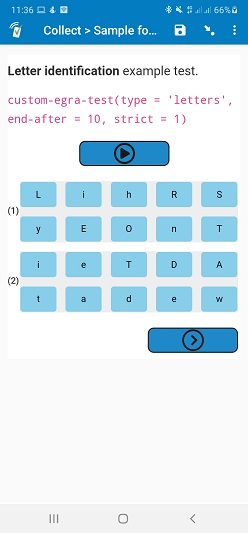

# Timed grid test

## Description

This field plug-in is designed to help execute the timed tests and assessments, where buttons are arranged in grid format. In particular, timed-grid-test is optimal for executing educational assessments like the Early Grade Reading Assessment (EGRA) and the Early Grade Mathematics Assessment (EGMA) on SurveyCTO. See features for a list of supported tests.

### Features

The timed-grid-test field plug-in has the following features:

* Appropriate choice list arrangement into a grid or text passage.
* Adaptive button layouts and pagination, depending on screen size.
* A built-in timer for limiting the duration of assessed activities.
* Prompt to prematurely end the test after X number of incorrect answers in line/row 1 of assessed text.
* Prompt to stop the test once the time runs out.
* Prompt to pick the last attempted item for the purpose of scoring.
* Stores sentence progress in an oral reading testing.
* Allows completing the test before allotted time has elapsed using the “Finish” button.

For EGRA, the following subtasks are possible:

* Letter identification
* Familiar word reading
* Nonword reading
* Oral reading fluency with comprehension

For details on these tests, please consult the [USAID EGRA Toolkit](https://pdf.usaid.gov/pdf_docs/PA00M4TN.pdf). Also see the [Support Center Guide to EGRA on SurveyCTO](https://support.surveycto.com/hc/en-us/articles/360052796233).

In the case of EGMA, this field plug-in can be used for these subtasks:

* Number identification
* Addition Level 1
* Subtraction Level 1

For details on these tests, please consult the [USAID EGMA Toolkit](https://ierc-publicfiles.s3.amazonaws.com/public/resources/EGMA%20Toolkit_March2014.pdf). Also see the [Support Center Guide to EGMA on SurveyCTO](https://support.surveycto.com/hc/en-us/articles/360052750634).

The [timed-field-list](https://github.com/surveycto/timed-field-list/blob/master/README.md) field plug-in is also useful for certain EGRA and EGMA subtasks.

### Data format

This field plug-in supports the [*select_multiple* field type]([https://docs.surveycto.com/02-designing-forms/01-core-concepts/03i.field-types-select-multiple.html](https://docs.surveycto.com/02-designing-forms/01-core-concepts/03i.field-types-select-multiple.html)), though the test data is stored in the field plug-ins metadata. The data is stored in a pipe-separated (|) list. For example:

    16714|7 14 16|true|17|88|3|85|No|12

You can retrieve the specific values with the [plug-in-metadata() function](https://docs.surveycto.com/02-designing-forms/01-core-concepts/09.expressions.html#plug-in-metadata) in your form design to return the following from these positions in the metadata:

* 0 to 2 - Reserved for internal processing (ignore these values)
* 3 - Amount of time remaining in seconds
* 4 - Total number of letters attempted
* 5 - Number of incorrect letters
* 6 - Number of correct letters
* 7 - Whether the firstline was all incorrect
* 8 - The number of sentence end marks (e.g. periods) passed, as indicated by the last attempted item when using the oral reading version of the test.

See the use of the `plug-in-metadata()` function in the [sample form](https://github.com/surveycto/timed-grid-test/raw/master/extras/sample-form/Sample%20form%20-%20Timed%20grid%20test%20field%20plug-in.xlsx) for details.

## How to use

1. Download the [sample form](https://github.com/surveycto/timed-grid-test/raw/master/extras/sample-form/Sample%20form%20-%20Timed%20grid%20test%20field%20plug-in.xlsx) from this repo and upload it to your SurveyCTO server.
1. Download the [timed-grid-test.fieldplugin.zip](https://github.com/surveycto/timed-grid-test/raw/master/timed-grid-test.fieldplugin.zip) file from this repo, and attach it to the test form on your SurveyCTO server.
1. Make sure to provide the correct parameters (see below).

### Parameters

|Key|Value|
|---|---|
|`type` (required)|Used to specify the kind of test the field plug-in is being used for. This determines the screen layout. You can specify any one of these values: <ul><li>`letters` - for the EGRA letter reading test. Creates 10 columns.</li><li> `words` - for the EGRA nonword or familiar word reading test. Creates 5 columns.</li><li>`reading` - for the EGRA reading/comprehension test. Arranges choice list in passage with variable button widths according to the size of words. </li><li>`numbers` - for the EGMA number identification test. Creates 5 columns.</li><li> `arithmetic` - for the EGMA addition/subtraction level 1 tests.Creates 2 columns.</li></ul>|
|`duration` (optional)|Used to specify the length of the test in seconds. Default is 60 seconds. Enter a custom value as required to override the default as required.|
|`end-after` (optional)|Used to specify the limit on the number of consecutive incorrect items that can be marked from the start before being prompted to end the test. The default is 10 for an EGRA letter reading test and 5 for an EGRA nonword or familiar reading test, but you can specify a custom value, including 0 to disable.|
|`strict` (optional)|Enable to enforce strict adherence to the time limit in duration. When strict is enabled (`strict = 1`), when the timer runs out, no more selections are possible. When strict is off (the default behavior) the user can continue to make selections once the time runs out. This will allow slower users to catch up according to what they heard before finishing the activity.|
|`pause` (optional)|The default behaviour is to not allow pausing a timed EGRA test. You can omit the pause parameter if the default behavior is desirable. However, if you would like the user to be allowed to pause the test, specify `pause = 1`.|
|`continuity` (optional)|Applies only to smaller screens if the test becomes paginated. When enabled (`continuity = 1`), it provides some visual continuity as to where the user is on their screen in relation to the print handout in front of the student being assessed. It achieves this by moving the bottom row on screen to the top of the next screen when you page forward. This feature is disabled by default, so specify nothing if you do not wish to use continuity.|

### Examples

To create a EGRA letter reading test that takes 30 seconds, with a strictly observed time limit, and ends if the respondent gets the first 10 letters incorrect, the following would be placed in the appearance column of the spreadsheet form definition:

    custom-timed-grid-test(type='letters', duration=30, strict=1, ends-with=10)

If you're using the online form designer, you could simply add the following to the _Plug-in parameters_ properties box:

    type='letters', duration=30, strict=1, ends-with=10

Similarly, an EGMA addition level 1 test that takes 50 seconds would have the following in its _appearance_ column of a spreadsheet form design:.

    custom-timed-grid-test(type='arithmetic', duration = 50)

## More resources

* **Sample form**  
You can find a form definition in this repo here: [extras/sample_form](https://github.com/surveycto/timed-grid-test/raw/master/extras/sample-form/Sample%20form%20-%20Timed%20grid%20test%20field%20plug-in.xlsx).
* **Developer documentation**  
More instructions for developing and using field plug-ins can be found here: [https://github.com/surveycto/Field-plug-in-resources](https://github.com/surveycto/Field-plug-in-resources)
* **User documentation**  
How to get started using field plug-ins in your SurveyCTO form. [https://docs.surveycto.com/02-designing-forms/03-advanced-topics/06.using-field-plug-ins.html](https://docs.surveycto.com/02-designing-forms/03-advanced-topics/06.using-field-plug-ins.html)
* **Support Center guide to EGRA** 
How to administer the Early Grade Reading Assessment (EGRA) using SurveyCTO.
[https://support.surveycto.com/hc/en-us/articles/360052796233](https://support.surveycto.com/hc/en-us/articles/360052796233)
* **Support Center guide to EGMA**
How to administer the Early Grade Mathematics Assessment (EGMA) using SurveyCTO.
[https://support.surveycto.com/hc/en-us/articles/360052750634](https://support.surveycto.com/hc/en-us/articles/360052750634)
